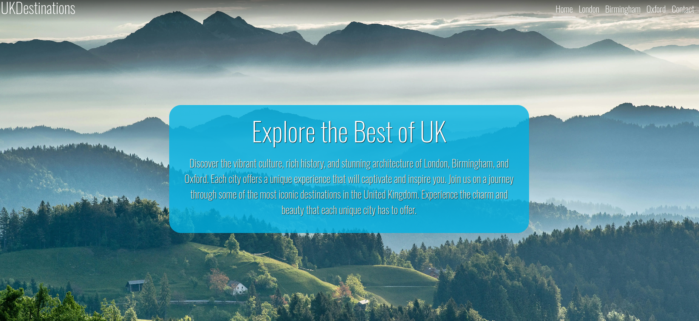
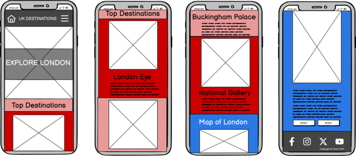
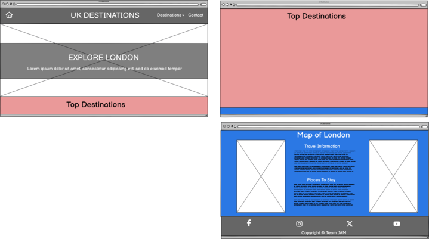
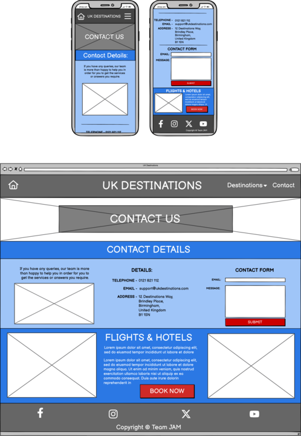
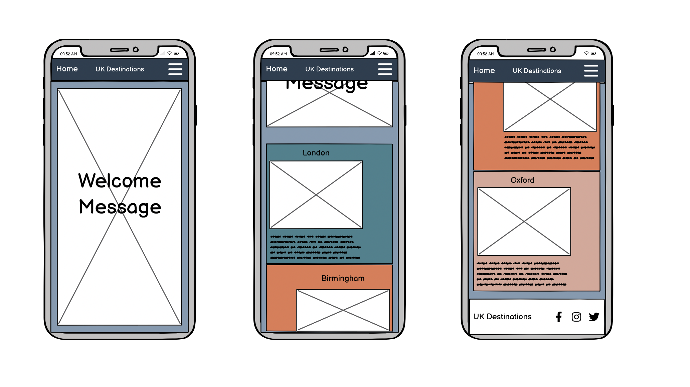
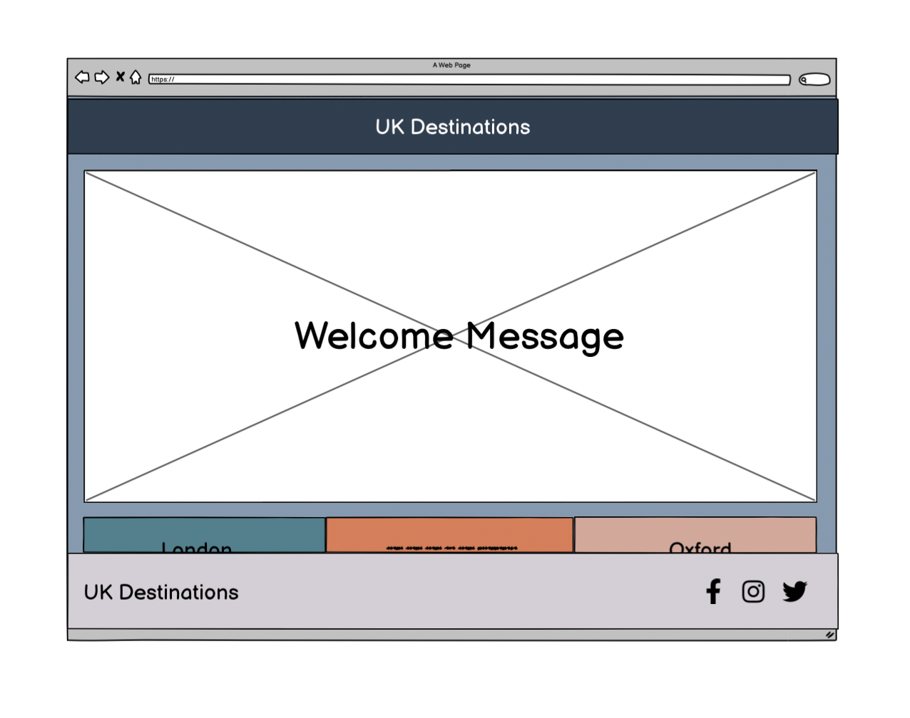
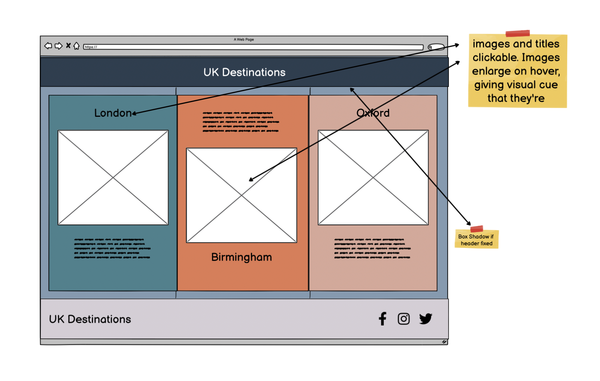

# UK Destinations - *Team JAM*



A front-end web application developed during a hackathon, for travel and tourist information at different UK Destinations, focusing on Accessibility and responsiveness.

## Table of Contents

1. [Introduction](#introduction)
2. [Project Overview](#project-overview)
3. [File Structure](#file-structure)
4. [Technologies Used](#technologies-used)
5. [Key Features](#key-features)
6. [Accessibility & Responsiveness](#accessibility--responsiveness)
7. [User Experience (UX) Design](#user-experience-ux-design)
8. [Testing & Validation](#testing--validation)
9. [Agile Development Process](#agile-development-process)
10. [Screenshots](#screenshots)

## Introduction

Welcome to the UK Destinations website! This project showcases three featured cities in the UK: Oxford, London, and Birmingham. Each city page provides detailed information about three key destinations within the city, along with interactive elements to enhance the user experience.

## Project Overview

The UK Destinations website is designed to offer users an informative and engaging experience when exploring major cities in the UK. The site includes detailed pages for Oxford, London, and Birmingham, each featuring:

- Three Destinations: In-depth information about three noteworthy destinations in each city.
- Interactive Links: Links to additional resources and details.
- Image Gallery: Visual representation of each destination.
- Interactive Map: A map showcasing the locations of the destinations.
- Travel Information: Useful travel tips and information.

## File Structure

```
/root
  ├── index.html                  # Home page
  ├── oxford.html                 # Oxford city page
  ├── london.html                 # London city page
  ├── birmingham.html             # Birmingham city page
  ├── contact.html                # Contact page  
  └── assets
      ├── images
      │   ├── oxford              # Images for Oxford
      │   ├── london              # Images for London
      │   ├── birmingham          # Images for Birmingham
      │   ├── contact             # Images for contact page
      │   └── favicons            # favicons for different browsers
      └── css
          ├── oxford.css          # Oxford page stylesheet
          ├── london.css          # London page stylesheet
          ├── birmingham.css      # Birmingham page stylesheet
          └── contact.css         # contact page stylesheet
```

## Technologies Used

* **Front-End:** HTML, CSS, Bootstrap 5.3
* **Version Control:** Git, GitHub
* **Deployment:** GitHub Pages
* **Testing:** W3C HTML Validator, Jigsaw CSS Validator

## Key Features

* **Navigation:** Intuitive navigation menu for seamless user experience.
* **Accessibility:** Prioritizes accessibility with proper color contrast, semantic markup, and alt text for images.
* **Responsiveness:**  Adapts to various screen sizes and devices using CSS media queries.
* **Interactive Elements:** Incorporates audio/video controls for engaging content.
* **City Pages:** Separate pages for Oxford, London, and Birmingham.
* **Destination Details:** Comprehensive information about key attractions.
* **Interactive Elements:** Links and maps to enhance user interaction.
* **Responsive Design:** Optimized for viewing on various devices.

## Accessibility & Responsiveness

* **Accessibility:** The website follows best practices for accessibility, including proper use of semantic HTML, alt text for images, and keyboard navigability.
* **Responsiveness:** Designed to be fully responsive and optimized for various screen sizes and devices. Media queries and flexible layouts ensure usability across desktops, tablets, and smartphones.

## User Experience (UX) Design

The website focuses on delivering a seamless and intuitive user experience. Key UX considerations include:

* **Easy Navigation:** Clear and logical site structure with easy access to city and destination information.
Interactive Elements: Engaging features such as maps and links to enhance user interaction.
* **Visual Appeal:** Consistent design and layout, with attention to color schemes and typography for a pleasant visual experience.

## Testing & Validation

* **Browser Testing:** The site has been tested across multiple browsers (Chrome, Firefox, Safari, Edge) to ensure compatibility.
* **Responsive Testing:** Various screen sizes and devices have been tested to guarantee a consistent experience.
Validation: HTML and CSS have been validated using W3C validators to ensure standards compliance.

* **W3C Validation:**  
    * No Errors, Bootstrap Related Warnings
* **Jigsaw Validation:** 
    * No Errors!
* **Responsiveness Testing:**  
    * iPhone 12 Pro, iPhone 13, Pixel 7 Pro (Android)
    * No Issues were present across all of the tested devices.
* **Cross-Browser Compatibility:** 
    * Edge, Google Chrome, Firefox
    * All tested with no issues
* **Link Validation:** 
    * Links All Work as expected, links to external websites target a blank page.
    * No broken links
* **Image Optimization:** 
    * Large images have been compressed and converted to Webp format


## Agile Development Process

* **Agile Methodology:**
    * Used a Kanban Project Board on Github
    * A stand up and stand down meeting took place daily. We wrote user stories and added into project board. Team Lead, assigned the team into different user stories to work on in a prioritized order. 
* **User Stories:** 
    * As a user, I want the website to have a clear and intuitive layout so I can easily find information about different cities and destinations. 
    * As a user, I want to be able to easily navigate between the pages for London, Birmingham, and Oxford so I can compare different destinations.
    * As a user, I want to be able to easily contact the website owners with questions or feedback so I can get help on any questions I might have
    * As a user, I want each destination page to have detailed information, including a description, images, and key facts, so I can decide if it's worth visiting.
    * As a user, I want each city page to have a visually appealing banner image and a brief overview of the city to give me a quick impression.
    * USER STORY: Buttons and links follow colour theme.
    * USER STORY: maps
    * USER STORY: Page load times
 
      SEE CLOSED ISSUES FOR MORE!

## Screenshots

### **Wireframes**
 #### Jawdon - London Page and Contact Page
 
 
 

 #### Akash - Home Page and Oxford Page
 
 
 

 #### Michael - Birmingham page
 
 

### Credits

**Team JAM**
- Jawdan Angelos
- Akash Khanna
- Michael Obadun

